```mermaid
graph TB
    subgraph "LEVEL 3: META-OBSERVATION"
        SS[🔴 SYSTEM_SENTINEL<br/>Token Budget • Deadlock Detection<br/>Cross-Agent Conflicts]
    end
    
    subgraph "LEVEL 2: DOMAIN OBSERVERS"
        CS[🛡️ CODE_SENTINEL<br/>Loop Detection<br/>Hallucination Watch<br/>Anti-Patterns]
        TS[⚠️ TRADE_SENTINEL<br/>Risk Validation<br/>Position Limits<br/>Stop-Loss Checks]
        DS[🎨 DESIGN_SENTINEL<br/>Cyberpunk Aesthetic<br/>UI Compliance<br/>Animation Standards]
    end
    
    subgraph "LEVEL 1: EXECUTION LAYER"
        OR[🎯 ORCHESTRATOR<br/>Task Coordination<br/>Phase Management]
        AR[🏗️ ARCHITECT<br/>System Design<br/>Tech Decisions]
        CO[💻 CODER<br/>Implementation<br/>TypeScript/React]
        CR[🔍 CRITIC<br/>Code Review<br/>Quality Gates]
        CL[🧹 CLEANER<br/>Refactoring<br/>Optimization]
        DO[📚 DOCS<br/>Documentation<br/>Knowledge Base]
    end
    
    subgraph "DATA SOURCES"
        BTC[₿ BTC Price Feed<br/>WebSocket]
        API[📡 Exchange APIs<br/>Binance/Coinbase]
        AI[🤖 Claude API<br/>Analysis]
    end
    
    %% Level 3 monitors Level 2
    SS --> CS
    SS --> TS
    SS --> DS
    
    %% Level 2 monitors Level 1
    CS --> CO
    CS --> CL
    TS --> CO
    TS --> AR
    DS --> CO
    DS --> AR
    
    %% Level 1 workflow
    OR --> AR
    AR --> CO
    CO --> CR
    CR -->|Approved| DO
    CR -->|Changes| CL
    CL --> CO
    
    %% Data connections
    BTC --> CO
    API --> CO
    AI --> CO
    
    style SS fill:#ff3366,stroke:#ff006e,color:#fff
    style CS fill:#00d4ff,stroke:#00ff9d,color:#000
    style TS fill:#ffaa00,stroke:#ff006e,color:#000
    style DS fill:#ff006e,stroke:#00ff9d,color:#fff
    style OR fill:#00ff9d,stroke:#00d4ff,color:#000
    style AR fill:#00ff9d,stroke:#00d4ff,color:#000
    style CO fill:#00ff9d,stroke:#00d4ff,color:#000
    style CR fill:#00ff9d,stroke:#00d4ff,color:#000
    style CL fill:#00ff9d,stroke:#00d4ff,color:#000
    style DO fill:#00ff9d,stroke:#00d4ff,color:#000
```

# Agent Communication Flow

```mermaid
sequenceDiagram
    participant U as User
    participant OR as @ORCHESTRATOR
    participant AR as @ARCHITECT
    participant CO as @CODER
    participant CR as @CRITIC
    participant TS as @TRADE_SENTINEL
    participant DS as @DESIGN_SENTINEL
    participant SS as @SYSTEM_SENTINEL
    
    U->>OR: New Feature Request
    OR->>AR: Design specification needed
    AR->>OR: ADR-XXX: Component Spec
    OR->>CO: Implement per ADR-XXX
    
    par Coding with Monitoring
        CO->>CO: Writing code
        TS-->>CO: [Watching trading logic]
        DS-->>CO: [Watching UI code]
    end
    
    CO->>CR: Ready for review
    CR->>CR: Running checklist
    
    alt Code Approved
        CR->>OR: ✅ APPROVED
        OR->>U: Feature complete
    else Changes Required
        CR->>CO: ❌ Must fix: [issues]
        CO->>CR: Fixed, re-review
    else Risk Violation Detected
        TS->>SS: [TRADE RISK ALERT]
        SS->>CO: [SYSTEM HALT]
        SS->>OR: Escalate to human
    end
```



# Intervention Escalation

```mermaid
flowchart LR
    subgraph "Self-Correction"
        A1[Agent catches own mistake]
    end
    
    subgraph "Peer Review"
        A2[@CRITIC catches issue]
    end
    
    subgraph "Domain Sentinel"
        A3[@CODE/TRADE/DESIGN_SENTINEL]
    end
    
    subgraph "System Sentinel"
        A4[@SYSTEM_SENTINEL]
    end
    
    subgraph "Human Escalation"
        A5[Claude Code User]
    end
    
    A1 --> A2 --> A3 --> A4 --> A5
    
    style A1 fill:#00ff9d
    style A2 fill:#00d4ff
    style A3 fill:#ffaa00
    style A4 fill:#ff006e
    style A5 fill:#ff3366
```

# Project Phase Flow


